# ZombieDefend Asset Catalog

> **Generated file — do not edit by hand.** Regenerate with `python3 tools/build-asset-catalog.py` (see [README.md](README.md#how-to-update)).
> Visual catalog: [catalog.html](https://peterlei853.github.io/ZombieDefend/assets/library/catalog.html) · machine index: [asset-index.json](asset-index.json)

| Category | Groups | Assets |
|---|---:|---:|
| [Hero](#hero) | 3 | 83 |
| [Zombies](#zombies) | 12 | 145 |
| [Bosses](#bosses) | 4 | 39 |
| [Shared FX](#fx) | 1 | 1 |
| [Pickups](#pickups) | 1 | 5 |
| [Backgrounds](#backgrounds) | 1 | 15 |
| [Concepts](#concepts) | 1 | 21 |
| **Total** | **23** | **309** |

## Hero

### Player Girl (hero) (女主角)

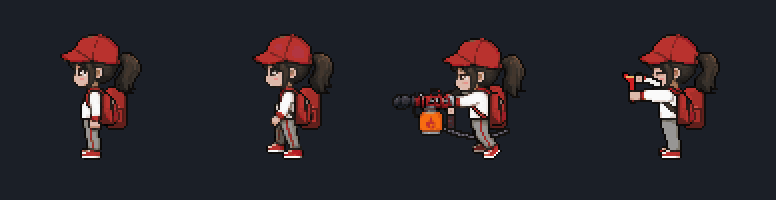

Chibi girl hero with red cap and backpack; base moves plus six weapons (water, bubble, lightning crossbow, frost, flame, sling). Faces WEST unless the key ends in -walk-east/-north/-south.

- group `girl` · 50 assets · frame 92x92 · key prefix `player-girl-` · manifest [characters/hero/girl/manifest.json](characters/hero/girl/manifest.json)
- previews: [all-base-sheet.png](previews/hero/girl/all-base-sheet.png), [weapon-water.gif](previews/hero/girl/weapon-water.gif), [weapon-bubble.gif](previews/hero/girl/weapon-bubble.gif), [weapon-lightning.gif](previews/hero/girl/weapon-lightning.gif), [weapon-frost.gif](previews/hero/girl/weapon-frost.gif), [weapon-flame.gif](previews/hero/girl/weapon-flame.gif), [weapon-sling.gif](previews/hero/girl/weapon-sling.gif)

| Key | Frames | Size | FPS | Playback | Origin | Notes |
|---|---:|---|---:|---|---|---|
| `player-girl-idle` | 8 | 92x92 | 8 | loop | (0.5, 0.8261) |  |
| `player-girl-walk-west` | 6 | 92x92 | 10 | loop | (0.5, 0.8261) | head of frame 0 re-used on frames 3-5 (PixelLab turned the head) |
| `player-girl-walk-east` | 6 | 92x92 | 10 | loop | (0.5, 0.8261) | faces east |
| `player-girl-walk-south` | 6 | 92x92 | 10 | loop | (0.5, 0.8261) | faces south |
| `player-girl-walk-north` | 6 | 92x92 | 10 | loop | (0.5, 0.8261) | faces north |
| `player-girl-hurt` | 4 | 92x92 | 12 | once | (0.5, 0.8261) |  |
| `player-girl-die` | 8 | 92x92 | 10 | once | (0.5, 0.8261) | hit flash 0, recoil 1-2, fall 3-5, lying 6-7 (hold last frame) |
| `player-girl-victory` | 8 | 92x92 | 10 | loop | (0.5, 0.8261) |  |
| `player-girl-water-idle` | 6 | 92x92 | 8 | loop | (0.5, 0.8261) |  |
| `player-girl-water-ready` | 6 | 92x92 | 10 | once | (0.5, 0.8261) | reach back to the backpack 0-2, pull out 3, bring up to aim 4-5 |
| `player-girl-water-walk-south` | 6 | 92x92 | 10 | loop | (0.5, 0.8261) | faces south |
| `player-girl-water-walk-north` | 6 | 92x92 | 10 | loop | (0.5, 0.8261) | faces north |
| `player-girl-bubble-idle` | 6 | 92x92 | 8 | loop | (0.5, 0.8261) |  |
| `player-girl-bubble-ready` | 6 | 92x92 | 10 | once | (0.5, 0.8261) | reach back to the backpack 0-2, pull out 3, bring up to aim 4-5 |
| `player-girl-bubble-walk-south` | 6 | 92x92 | 10 | loop | (0.5, 0.8261) | faces south |
| `player-girl-bubble-walk-north` | 6 | 92x92 | 10 | loop | (0.5, 0.8261) | faces north |
| `player-girl-lightning-idle` | 6 | 92x92 | 8 | loop | (0.5, 0.8261) |  |
| `player-girl-lightning-ready` | 6 | 92x92 | 10 | once | (0.5, 0.8261) | reach back to the backpack 0-2, pull out 3, bring up to aim 4-5 |
| `player-girl-lightning-walk-south` | 6 | 92x92 | 10 | loop | (0.5, 0.8261) | faces south |
| `player-girl-lightning-walk-north` | 6 | 92x92 | 10 | loop | (0.5, 0.8261) | faces north |
| `player-girl-frost-idle` | 6 | 92x92 | 8 | loop | (0.5, 0.8261) |  |
| `player-girl-frost-ready` | 6 | 92x92 | 10 | once | (0.5, 0.8261) | reach back to the backpack 0-2, pull out 3, bring up to aim 4-5 |
| `player-girl-frost-walk-south` | 6 | 92x92 | 10 | loop | (0.5, 0.8261) | faces south |
| `player-girl-frost-walk-north` | 6 | 92x92 | 10 | loop | (0.5, 0.8261) | faces north |
| `player-girl-flame-idle` | 6 | 92x92 | 8 | loop | (0.5, 0.8261) |  |
| `player-girl-flame-ready` | 6 | 92x92 | 10 | once | (0.5, 0.8261) | reach back to the backpack 0-2, pull out 3, bring up to aim 4-5 |
| `player-girl-flame-walk-south` | 6 | 92x92 | 10 | loop | (0.5, 0.8261) | faces south |
| `player-girl-flame-walk-north` | 6 | 92x92 | 10 | loop | (0.5, 0.8261) | faces north |
| `player-girl-water-fire` | 9 | 92x92 | 12 | start 0-2 once, loop 3-6, end 7-8 once | (0.5, 0.8261) | play 0-2 once (start), loop 3-6 while firing, then 7-8 (end) |
| `player-girl-sling-ready` | 6 | 92x92 | 10 | once | (0.5, 0.8261) | reach back to the hip 0-1, pull out 2-3, raise 4-5 |
| `player-girl-sling-fire` | 8 | 92x92 | 12 | once | (0.5, 0.8261) | pull-back 0-5, release on frame 6 (spawn pellet), recover 7 |
| `player-girl-sling-walk-south` | 6 | 92x92 | 10 | loop | (0.5, 0.8261) | faces south |
| `player-girl-sling-walk-north` | 6 | 92x92 | 10 | loop | (0.5, 0.8261) | faces north |
| `player-girl-bubble-fire` | 9 | 92x92 | 12 | start 0-2 once, loop 3-6, end 7-8 once | (0.5, 0.8261) | play 0-2 once (start), loop 3-6 while firing, then 7-8 (end) |
| `player-girl-frost-fire` | 9 | 92x92 | 12 | start 0-2 once, loop 3-6, end 7-8 once | (0.5, 0.8261) | play 0-2 once (start), loop 3-6 while firing, then 7-8 (end) |
| `player-girl-flame-fire` | 9 | 92x92 | 12 | start 0-2 once, loop 3-6, end 7-8 once | (0.5, 0.8261) | play 0-2 once (start), loop 3-6 while firing, then 7-8 (end) |
| `player-girl-sling-idle` | 6 | 92x92 | 8 | loop | (0.5, 0.8261) |  |
| `player-girl-lightning-fire` | 8 | 92x92 | 12 | once | (0.5, 0.8261) | raise/aim 0-3, shoot on frame 4 (spawn bolt, rim flash), recoil 4-6, settle 7 |
| `player-girl-water-walk-west` | 6 | 92x92 | 10 | loop | (0.5, 0.8261) |  |
| `player-girl-water-walk-east` | 6 | 92x92 | 10 | loop | (0.5, 0.8261) | faces east |
| `player-girl-bubble-walk-west` | 6 | 92x92 | 10 | loop | (0.5, 0.8261) |  |
| `player-girl-bubble-walk-east` | 6 | 92x92 | 10 | loop | (0.5, 0.8261) | faces east |
| `player-girl-lightning-walk-west` | 6 | 92x92 | 10 | loop | (0.5, 0.8261) |  |
| `player-girl-lightning-walk-east` | 6 | 92x92 | 10 | loop | (0.5, 0.8261) | faces east · ponytail of frame 0 re-used (PixelLab made it fly) |
| `player-girl-frost-walk-west` | 6 | 92x92 | 10 | loop | (0.5, 0.8261) |  |
| `player-girl-frost-walk-east` | 6 | 92x92 | 10 | loop | (0.5, 0.8261) | faces east |
| `player-girl-flame-walk-west` | 6 | 92x92 | 10 | loop | (0.5, 0.8261) |  |
| `player-girl-flame-walk-east` | 6 | 92x92 | 10 | loop | (0.5, 0.8261) | faces east |
| `player-girl-sling-walk-west` | 6 | 92x92 | 10 | loop | (0.5, 0.8261) |  |
| `player-girl-sling-walk-east` | 6 | 92x92 | 10 | loop | (0.5, 0.8261) | faces east |

### Player Girl — weapon FX (女主角武器特效)

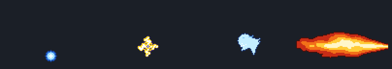

Procedural pixel FX for the hero weapons: muzzles, projectiles, beams/streams (tileable), impacts and status overlays (wet, dizzy, paralyze, bubble trap, frost shatter). Directional FX point WEST (toward the zombies).

- group `girl-fx` · 27 assets · frame 8x8, 12x12, 14x10, 16x16, 24x24, 24x32, 28x24, 32x12, 32x28, 32x32, 36x32, 40x18, 40x40, 48x24, 64x14, 64x16, 64x24, 64x64, 96x40 · key prefix `fx-` · manifest [characters/hero/girl/fx/manifest.json](characters/hero/girl/fx/manifest.json)
- previews: [fx-sheet.png](previews/hero/girl-fx/fx-sheet.png)

| Key | Frames | Size | FPS | Playback | Origin | Notes |
|---|---:|---|---:|---|---|---|
| `fx-water-muzzle` | 4 | 28x24 | 12 | once | (1.0, 0.5) |  |
| `fx-water-stream` | 4 | 64x16 | 12 | loop | (0.5, 0.5) | seamless horizontal tile; repeat/stretch leftward from muzzle (TileSprite) |
| `fx-water-impact` | 6 | 36x32 | 12 | once | (0.5, 0.69) |  |
| `fx-water-wet` | 6 | 64x64 | 8 | loop | (0.5, 1.0) | overlay on a wet zombie (feet at origin) |
| `fx-sling-pellet` | 4 | 14x10 | 16 | loop | (0.29, 0.5) |  |
| `fx-sling-impact` | 6 | 40x40 | 14 | once | (0.5, 0.5) |  |
| `fx-sling-dizzy` | 8 | 40x18 | 10 | loop | (0.5, 1.0) | overlay above stunned zombie head (origin bottom-center = head top) |
| `fx-bubble-muzzle` | 4 | 32x28 | 12 | once | (1.0, 0.5) |  |
| `fx-bubble-proj-s` | 4 | 8x8 | 8 | loop | (0.5, 0.5) |  |
| `fx-bubble-proj-m` | 4 | 12x12 | 8 | loop | (0.5, 0.5) |  |
| `fx-bubble-proj-l` | 4 | 16x16 | 8 | loop | (0.5, 0.5) |  |
| `fx-bubble-pop` | 5 | 24x24 | 14 | once | (0.5, 0.5) |  |
| `fx-bubble-trap-form` | 5 | 64x64 | 12 | once | (0.5, 1.0) | play once, then trap-loop, then trap-pop |
| `fx-bubble-trap-loop` | 6 | 64x64 | 8 | loop | (0.5, 1.0) |  |
| `fx-bubble-trap-pop` | 5 | 64x64 | 14 | once | (0.5, 1.0) |  |
| `fx-lightning-bolt` | 4 | 32x12 | 16 | loop | (0.15, 0.5) |  |
| `fx-lightning-impact` | 6 | 40x40 | 14 | once | (0.5, 0.5) |  |
| `fx-lightning-chain` | 4 | 64x24 | 16 | loop | (0.0, 0.5) | tileable horizontal arc (ends at y=12); use TileSprite or scaleX to span targets |
| `fx-lightning-paralyze` | 6 | 64x64 | 12 | loop | (0.5, 1.0) | overlay on paralysed zombie (origin feet) |
| `fx-frost-muzzle` | 4 | 24x32 | 12 | once | (1.0, 0.5) |  |
| `fx-frost-beam` | 4 | 64x14 | 12 | loop | (0.5, 0.5) | seamless horizontal tile; repeat leftward from muzzle |
| `fx-frost-impact` | 8 | 40x40 | 12 | once | (0.5, 0.83) |  |
| `fx-frost-shatter` | 10 | 64x64 | 14 | once | (0.5, 0.7) |  |
| `fx-flame-muzzle` | 4 | 24x24 | 14 | once | (1.0, 0.5) |  |
| `fx-flame-cone` | 6 | 96x40 | 12 | loop | (1.0, 0.5) | origin at nozzle (right-middle); cone extends 96px west |
| `fx-flame-ground` | 6 | 48x24 | 10 | loop | (0.5, 0.92) |  |
| `fx-flame-smoke` | 8 | 32x32 | 10 | once | (0.5, 0.75) |  |

### Player Girl — weapon icons (武器圖示)

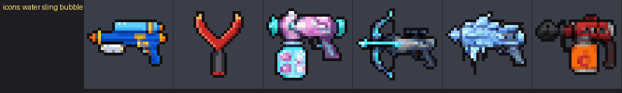

32x32 weapon icons for HUD / shop (single images, load with this.load.image).

- group `girl-icons` · 6 assets · frame 32x32 · key prefix `icon-` · manifest [characters/hero/girl/icons/manifest.json](characters/hero/girl/icons/manifest.json)
- previews: [icons-sheet.png](previews/hero/girl-icons/icons-sheet.png)

| Key | File | Size | Type | Notes |
|---|---|---|---|---|
| `icon-water` | [icon-water.png](characters/hero/girl/icons/icon-water.png) | 32x32 | icon | Player Girl — weapon icons: water (32x32 image). |
| `icon-sling` | [icon-sling.png](characters/hero/girl/icons/icon-sling.png) | 32x32 | icon | Player Girl — weapon icons: sling (32x32 image). |
| `icon-bubble` | [icon-bubble.png](characters/hero/girl/icons/icon-bubble.png) | 32x32 | icon | Player Girl — weapon icons: bubble (32x32 image). |
| `icon-lightning` | [icon-lightning.png](characters/hero/girl/icons/icon-lightning.png) | 32x32 | icon | Player Girl — weapon icons: lightning (32x32 image). |
| `icon-frost` | [icon-frost.png](characters/hero/girl/icons/icon-frost.png) | 32x32 | icon | Player Girl — weapon icons: frost (32x32 image). |
| `icon-flame` | [icon-flame.png](characters/hero/girl/icons/icon-flame.png) | 32x32 | icon | Player Girl — weapon icons: flame (32x32 image). |

## Zombies

### Giant Mutant Brute (巨型突變暴君)

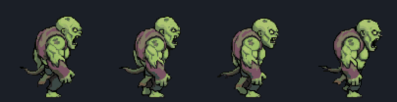

Large 96x96 mini-boss zombie with heavy hurt, part break, blast-back and defeat strips.

- group `brute` · 15 assets · frame 96x96 · key prefix `zombie-brute-` · manifest [enemies/zombies/brute/manifest.json](enemies/zombies/brute/manifest.json)
- previews: [all-actions-sheet.png](previews/zombies/brute/all-actions-sheet.png), [unique-actions-sheet.png](previews/zombies/brute/unique-actions-sheet.png), [special-sheet.png](previews/zombies/brute/special-sheet.png), [elemental-hits-sheet.png](previews/zombies/brute/elemental-hits-sheet.png), [special-sequence.gif](previews/zombies/brute/special-sequence.gif)

| Key | Frames | Size | FPS | Playback | Origin | Notes |
|---|---:|---|---:|---|---|---|
| `zombie-brute-walk` | 8 | 96x96 | 8 | loop | (0.5, 1.0) |  |
| `zombie-brute-run` | 8 | 96x96 | 12 | loop | (0.5, 1.0) |  |
| `zombie-brute-die1` | 8 | 96x96 | 10 | once | (0.5, 1.0) |  |
| `zombie-brute-die2` | 8 | 96x96 | 10 | once | (0.5, 1.0) |  |
| `zombie-brute-attack` | 8 | 96x96 | 10 | loop | (0.5, 1.0) |  |
| `zombie-brute-bite` | 8 | 96x96 | 10 | loop | (0.5, 1.0) |  |
| `zombie-brute-hurt` | 4 | 96x96 | 10 | once | (0.5, 1.0) |  |
| `zombie-brute-idle_itch` | 8 | 96x96 | 6 | loop | (0.5, 1.0) |  |
| `zombie-brute-hurt_freeze` | 8 | 96x96 | 10 | once | (0.5, 1.0) |  |
| `zombie-brute-hurt_burn` | 8 | 96x96 | 10 | loop | (0.5, 1.0) |  |
| `zombie-brute-hurt_shock` | 6 | 96x96 | 12 | loop | (0.5, 1.0) |  |
| `zombie-brute-hurt_heavy` | 6 | 96x96 | 10 | once | (0.5, 1.0) |  |
| `zombie-brute-part_break` | 8 | 96x96 | 10 | once | (0.5, 1.0) |  |
| `zombie-brute-blasted_back` | 8 | 96x96 | 10 | once | (0.5, 1.0) |  |
| `zombie-brute-defeated` | 8 | 96x96 | 10 | once | (0.5, 1.0) |  |

### Comedic Loot Dropper (Clown) (小丑/奇特搞怪喪屍)

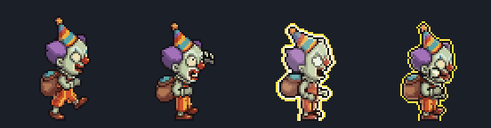

Loot zombie: hurt_loot drops coins/gems, loot_explode bursts on death and ends on the loot-pile pickup (see pickups/clown-loot).

- group `clown` · 13 assets · frame 64x64 · key prefix `zombie-clown-` · manifest [enemies/zombies/clown/manifest.json](enemies/zombies/clown/manifest.json)
- previews: [all-actions-sheet.png](previews/zombies/clown/all-actions-sheet.png), [special-sheet.png](previews/zombies/clown/special-sheet.png), [elemental-hits-sheet.png](previews/zombies/clown/elemental-hits-sheet.png)

| Key | Frames | Size | FPS | Playback | Origin | Notes |
|---|---:|---|---:|---|---|---|
| `zombie-clown-walk` | 8 | 64x64 | 8 | loop | (0.5, 1.0) |  |
| `zombie-clown-run` | 8 | 64x64 | 12 | loop | (0.5, 1.0) |  |
| `zombie-clown-die1` | 8 | 64x64 | 10 | once | (0.5, 1.0) |  |
| `zombie-clown-die2` | 8 | 64x64 | 10 | once | (0.5, 1.0) |  |
| `zombie-clown-attack` | 8 | 64x64 | 10 | loop | (0.5, 1.0) |  |
| `zombie-clown-bite` | 8 | 64x64 | 10 | loop | (0.5, 1.0) |  |
| `zombie-clown-hurt` | 4 | 64x64 | 10 | once | (0.5, 1.0) | Recoils west (snap back), then recovers. |
| `zombie-clown-idle_itch` | 8 | 64x64 | 6 | loop | (0.5, 1.0) |  |
| `zombie-clown-hurt_freeze` | 8 | 64x64 | 10 | once | (0.5, 1.0) |  |
| `zombie-clown-hurt_burn` | 8 | 64x64 | 10 | loop | (0.5, 1.0) |  |
| `zombie-clown-hurt_shock` | 6 | 64x64 | 12 | loop | (0.5, 1.0) |  |
| `zombie-clown-hurt_loot` | 6 | 64x64 | 10 | once | (0.5, 1.0) | Play once on a hit. Coins, gems and confetti popping out of the sack are baked in as visuals; spawn real pickups (zombie-clown-coin / zombie-clown-gem-*) in game at the sack around frame 1-2. |
| `zombie-clown-loot_explode` | 12 | 64x64 | 10 | once | (0.5, 1.0) | Play once on death: inflates like a balloon with a trembling rim flash, sack bulging (0-3), burst (4), coins/gems/confetti/stars rain down while the pile grows (5-10), last frame (11) = zombie-clown-loot-pile frame 0 at the bottom of the 64x64 canvas, so you can swap to the pile pickup (origin bottom-centre) seamlessly. The party hat flies off on the burst. |

### Cyborg Scientist Zombie (半機械改造喪屍)

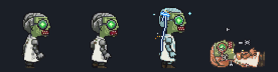

Half-machine zombie: spark hurt, fall, and self-destruct explode strips.

- group `cyborg` · 14 assets · frame 64x64 · key prefix `zombie-cyborg-` · manifest [enemies/zombies/cyborg/manifest.json](enemies/zombies/cyborg/manifest.json)
- previews: [all-actions-sheet.png](previews/zombies/cyborg/all-actions-sheet.png), [special-sheet.png](previews/zombies/cyborg/special-sheet.png), [elemental-hits-sheet.png](previews/zombies/cyborg/elemental-hits-sheet.png), [fall.gif](previews/zombies/cyborg/fall.gif)

| Key | Frames | Size | FPS | Playback | Origin | Notes |
|---|---:|---|---:|---|---|---|
| `zombie-cyborg-walk` | 8 | 64x64 | 8 | loop | (0.5, 1.0) |  |
| `zombie-cyborg-run` | 8 | 64x64 | 12 | loop | (0.5, 1.0) |  |
| `zombie-cyborg-die1` | 8 | 64x64 | 10 | once | (0.5, 1.0) |  |
| `zombie-cyborg-die2` | 8 | 64x64 | 10 | once | (0.5, 1.0) |  |
| `zombie-cyborg-attack` | 8 | 64x64 | 10 | loop | (0.5, 1.0) |  |
| `zombie-cyborg-bite` | 8 | 64x64 | 10 | loop | (0.5, 1.0) |  |
| `zombie-cyborg-hurt` | 4 | 64x64 | 10 | once | (0.5, 1.0) |  |
| `zombie-cyborg-idle_itch` | 8 | 64x64 | 6 | loop | (0.5, 1.0) |  |
| `zombie-cyborg-hurt_freeze` | 8 | 64x64 | 10 | once | (0.5, 1.0) |  |
| `zombie-cyborg-hurt_burn` | 8 | 64x64 | 10 | loop | (0.5, 1.0) |  |
| `zombie-cyborg-hurt_shock` | 6 | 64x64 | 12 | loop | (0.5, 1.0) |  |
| `zombie-cyborg-hurt_spark` | 6 | 64x64 | 12 | loop | (0.5, 1.0) |  |
| `zombie-cyborg-fall` | 8 | 64x64 | 10 | once | (0.5, 1.0) |  |
| `zombie-cyborg-explode` | 8 | 64x64 | 10 | once | (0.5, 1.0) |  |

### Bloated Toxic Exploder (劇毒自爆型喪屍)

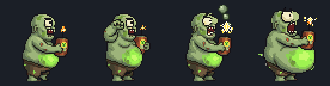

Self-destructing zombie. `zombie-exploder-explode` is the body animation; spawn the shared fx `zombie-exploder-blast` (assets/library/fx) at the body for the chain-reaction blast.

- group `exploder` · 13 assets · frame 64x64 · key prefix `zombie-exploder-` · manifest [enemies/zombies/exploder/manifest.json](enemies/zombies/exploder/manifest.json)
- previews: [all-actions-sheet.png](previews/zombies/exploder/all-actions-sheet.png), [unique-actions-sheet.png](previews/zombies/exploder/unique-actions-sheet.png), [special-sheet.png](previews/zombies/exploder/special-sheet.png), [elemental-hits-sheet.png](previews/zombies/exploder/elemental-hits-sheet.png)

| Key | Frames | Size | FPS | Playback | Origin | Notes |
|---|---:|---|---:|---|---|---|
| `zombie-exploder-walk` | 8 | 64x64 | 8 | loop | (0.5, 1.0) |  |
| `zombie-exploder-run` | 8 | 64x64 | 12 | loop | (0.5, 1.0) |  |
| `zombie-exploder-die1` | 8 | 64x64 | 10 | once | (0.5, 1.0) |  |
| `zombie-exploder-die2` | 8 | 64x64 | 10 | once | (0.5, 1.0) |  |
| `zombie-exploder-attack` | 8 | 64x64 | 10 | loop | (0.5, 1.0) |  |
| `zombie-exploder-bite` | 8 | 64x64 | 10 | loop | (0.5, 1.0) |  |
| `zombie-exploder-hurt` | 4 | 64x64 | 10 | once | (0.5, 1.0) |  |
| `zombie-exploder-idle_itch` | 8 | 64x64 | 6 | loop | (0.5, 1.0) |  |
| `zombie-exploder-hurt_freeze` | 8 | 64x64 | 10 | once | (0.5, 1.0) |  |
| `zombie-exploder-hurt_burn` | 8 | 64x64 | 10 | loop | (0.5, 1.0) |  |
| `zombie-exploder-hurt_shock` | 8 | 64x64 | 12 | loop | (0.5, 1.0) |  |
| `zombie-exploder-hurt_terrified` | 6 | 64x64 | 10 | loop | (0.5, 1.0) |  |
| `zombie-exploder-explode` | 12 | 64x64 | 10 | once | (0.5, 1.0) |  |

### Office Worker Zombie (上班族丧尸)

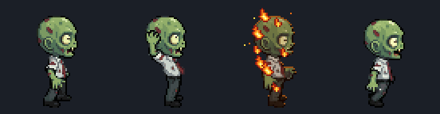

Monster 01. Baseline shambling salaryman zombie: walk/run, attack/bite loops, two deaths, hurt and elemental hit reactions.

- group `office-worker` · 11 assets · frame 64x64 · key prefix `zombie-office-` · manifest [enemies/zombies/office-worker/manifest.json](enemies/zombies/office-worker/manifest.json)
- previews: [all-actions-sheet.png](previews/zombies/office-worker/all-actions-sheet.png), [attack-bite-sheet.png](previews/zombies/office-worker/attack-bite-sheet.png), [elemental-hits-sheet.png](previews/zombies/office-worker/elemental-hits-sheet.png)

| Key | Frames | Size | FPS | Playback | Origin | Notes |
|---|---:|---|---:|---|---|---|
| `zombie-office-walk` | 8 | 64x64 | 8 | loop | (0.5, 1.0) |  |
| `zombie-office-run` | 8 | 64x64 | 12 | loop | (0.5, 1.0) |  |
| `zombie-office-die1` | 8 | 64x64 | 10 | once | (0.5, 1.0) |  |
| `zombie-office-die2` | 8 | 64x64 | 10 | once | (0.5, 1.0) |  |
| `zombie-office-attack` | 8 | 64x64 | 10 | loop | (0.5, 1.0) |  |
| `zombie-office-bite` | 8 | 64x64 | 10 | loop | (0.5, 1.0) |  |
| `zombie-office-hurt` | 4 | 64x64 | 10 | once | (0.5, 1.0) |  |
| `zombie-office-idle_itch` | 8 | 64x64 | 6 | loop | (0.5, 1.0) |  |
| `zombie-office-hurt_freeze` | 8 | 64x64 | 10 | once | (0.5, 1.0) |  |
| `zombie-office-hurt_burn` | 8 | 64x64 | 10 | loop | (0.5, 1.0) |  |
| `zombie-office-hurt_shock` | 6 | 64x64 | 12 | loop | (0.5, 1.0) |  |

### Heavy Armored Riot Zombie (armored) (重裝防爆喪屍（可破甲）)

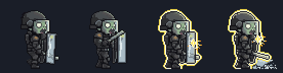

Armored phase with shield: hurt_armor, shield_break (loses shield), armor_break (loses helmet/plates), then switch to the riot-bare group.

- group `riot` · 11 assets · frame 64x64 · key prefix `zombie-riot-` · manifest [enemies/zombies/riot/manifest.json](enemies/zombies/riot/manifest.json)
- previews: [armored-actions-sheet.png](previews/zombies/riot/armored-actions-sheet.png), [special-sheet.png](previews/zombies/riot/special-sheet.png), [elemental-hits-sheet.png](previews/zombies/riot/elemental-hits-sheet.png), [special-sequence.gif](previews/zombies/riot/special-sequence.gif)

| Key | Frames | Size | FPS | Playback | Origin | Notes |
|---|---:|---|---:|---|---|---|
| `zombie-riot-walk` | 8 | 64x64 | 8 | loop | (0.5, 1.0) |  |
| `zombie-riot-run` | 8 | 64x64 | 12 | loop | (0.5, 1.0) |  |
| `zombie-riot-attack` | 8 | 64x64 | 10 | loop | (0.5, 1.0) |  |
| `zombie-riot-bite` | 8 | 64x64 | 10 | loop | (0.5, 1.0) |  |
| `zombie-riot-idle_itch` | 8 | 64x64 | 6 | loop | (0.5, 1.0) |  |
| `zombie-riot-hurt_armor` | 6 | 64x64 | 10 | once | (0.5, 1.0) |  |
| `zombie-riot-shield_break` | 12 | 64x64 | 10 | once | (0.5, 1.0) |  |
| `zombie-riot-armor_break` | 12 | 64x64 | 10 | once | (0.5, 1.0) |  |
| `zombie-riot-hurt_freeze` | 8 | 64x64 | 10 | once | (0.5, 1.0) |  |
| `zombie-riot-hurt_burn` | 8 | 64x64 | 10 | loop | (0.5, 1.0) |  |
| `zombie-riot-hurt_shock` | 6 | 64x64 | 12 | loop | (0.5, 1.0) |  |

### Riot Zombie (bare, after armor break) (防爆喪屍（破甲後）)

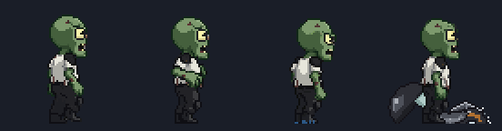

Unarmored phase after `zombie-riot-armor_break`, incl. dismantled_defeat death.

- group `riot-bare` · 12 assets · frame 64x64 · key prefix `zombie-riot-bare-` · manifest [enemies/zombies/riot-bare/manifest.json](enemies/zombies/riot-bare/manifest.json)
- previews: [bare-actions-sheet.png](previews/zombies/riot-bare/bare-actions-sheet.png)

| Key | Frames | Size | FPS | Playback | Origin | Notes |
|---|---:|---|---:|---|---|---|
| `zombie-riot-bare-walk` | 8 | 64x64 | 8 | loop | (0.5, 1.0) |  |
| `zombie-riot-bare-run` | 8 | 64x64 | 12 | loop | (0.5, 1.0) |  |
| `zombie-riot-bare-die1` | 8 | 64x64 | 10 | once | (0.5, 1.0) |  |
| `zombie-riot-bare-die2` | 8 | 64x64 | 10 | once | (0.5, 1.0) |  |
| `zombie-riot-bare-attack` | 8 | 64x64 | 10 | loop | (0.5, 1.0) |  |
| `zombie-riot-bare-bite` | 8 | 64x64 | 10 | loop | (0.5, 1.0) |  |
| `zombie-riot-bare-hurt` | 4 | 64x64 | 10 | once | (0.5, 1.0) |  |
| `zombie-riot-bare-idle_itch` | 8 | 64x64 | 6 | loop | (0.5, 1.0) |  |
| `zombie-riot-bare-hurt_freeze` | 8 | 64x64 | 10 | once | (0.5, 1.0) |  |
| `zombie-riot-bare-hurt_burn` | 8 | 64x64 | 10 | loop | (0.5, 1.0) |  |
| `zombie-riot-bare-hurt_shock` | 6 | 64x64 | 12 | loop | (0.5, 1.0) |  |
| `zombie-riot-bare-dismantled_defeat` | 8 | 64x64 | 10 | once | (0.5, 1.0) |  |

### Splitting Slime Zombie (分裂型史萊姆喪屍)

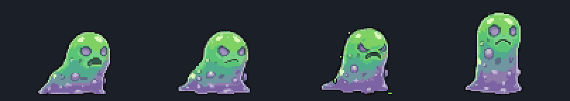

Splits on death: `zombie-slime-split` (96x64) ends as two mini slimes; spawn two slime-mini at spawnOffsetsX.

- group `slime` · 14 assets · frame 64x64, 96x64 · key prefix `zombie-slime-` · manifest [enemies/zombies/slime/manifest.json](enemies/zombies/slime/manifest.json)
- previews: [all-actions-sheet.png](previews/zombies/slime/all-actions-sheet.png), [special-sheet.png](previews/zombies/slime/special-sheet.png), [elemental-hits-sheet.png](previews/zombies/slime/elemental-hits-sheet.png)

| Key | Frames | Size | FPS | Playback | Origin | Notes |
|---|---:|---|---:|---|---|---|
| `zombie-slime-walk` | 8 | 64x64 | 8 | loop | (0.5, 1.0) |  |
| `zombie-slime-run` | 8 | 64x64 | 12 | loop | (0.5, 1.0) |  |
| `zombie-slime-die1` | 8 | 64x64 | 10 | once | (0.5, 1.0) |  |
| `zombie-slime-die2` | 8 | 64x64 | 10 | once | (0.5, 1.0) |  |
| `zombie-slime-attack` | 8 | 64x64 | 10 | loop | (0.5, 1.0) |  |
| `zombie-slime-bite` | 8 | 64x64 | 10 | loop | (0.5, 1.0) |  |
| `zombie-slime-hurt` | 4 | 64x64 | 10 | once | (0.5, 1.0) |  |
| `zombie-slime-idle_itch` | 8 | 64x64 | 6 | loop | (0.5, 1.0) |  |
| `zombie-slime-hurt_freeze` | 8 | 64x64 | 10 | once | (0.5, 1.0) |  |
| `zombie-slime-hurt_burn` | 8 | 64x64 | 10 | loop | (0.5, 1.0) |  |
| `zombie-slime-hurt_shock` | 6 | 64x64 | 12 | loop | (0.5, 1.0) |  |
| `zombie-slime-hurt_jiggle` | 6 | 64x64 | 10 | loop | (0.5, 1.0) |  |
| `zombie-slime-split` | 8 | 96x64 | 10 | once | (0.5, 1.0) | spawnOffsetsX [-28, 28] · 96x64 canvas (wider than the 64x64 base). Same origin semantics (0.5,1.0): canvas centre-bottom = slime position. Ends as two slime-mini stand poses; swap to zombie-slime-mini-* at x offsets spawnOffsetsX. |
| `zombie-slime-splatter` | 8 | 64x64 | 10 | once | (0.5, 1.0) |  |

### Mini Slime (split child) (小史萊姆)

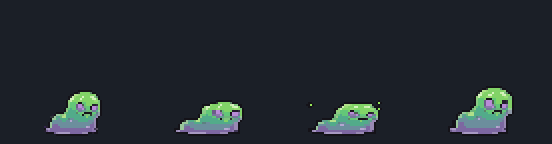

Child slime spawned by zombie-slime-split. 64x64 canvas, smaller body.

- group `slime-mini` · 6 assets · frame 64x64 · key prefix `zombie-slime-mini-` · manifest [enemies/zombies/slime-mini/manifest.json](enemies/zombies/slime-mini/manifest.json)
- previews: [mini-actions-sheet.png](previews/zombies/slime-mini/mini-actions-sheet.png)

| Key | Frames | Size | FPS | Playback | Origin | Notes |
|---|---:|---|---:|---|---|---|
| `zombie-slime-mini-walk` | 8 | 64x64 | 8 | loop | (0.5, 1.0) |  |
| `zombie-slime-mini-idle` | 8 | 64x64 | 6 | loop | (0.5, 1.0) |  |
| `zombie-slime-mini-run` | 8 | 64x64 | 12 | loop | (0.5, 1.0) |  |
| `zombie-slime-mini-hurt` | 4 | 64x64 | 10 | once | (0.5, 1.0) |  |
| `zombie-slime-mini-die` | 8 | 64x64 | 10 | once | (0.5, 1.0) |  |
| `zombie-slime-mini-splatter` | 8 | 64x64 | 10 | once | (0.5, 1.0) |  |

### Fast Runner (high knockback) (瘋狂奔跑與擊飛喪屍)

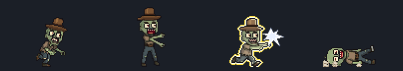

Fast zombie that gets launched: blasted_back + tumble (96x64, translate x in code) then comedic_ko (loops frames 4-7).

- group `sprinter` · 14 assets · frame 64x64, 96x64 · key prefix `zombie-sprinter-` · manifest [enemies/zombies/sprinter/manifest.json](enemies/zombies/sprinter/manifest.json)
- previews: [all-actions-sheet.png](previews/zombies/sprinter/all-actions-sheet.png), [special-sheet.png](previews/zombies/sprinter/special-sheet.png), [elemental-hits-sheet.png](previews/zombies/sprinter/elemental-hits-sheet.png)

| Key | Frames | Size | FPS | Playback | Origin | Notes |
|---|---:|---|---:|---|---|---|
| `zombie-sprinter-walk` | 8 | 64x64 | 8 | loop | (0.5, 1.0) |  |
| `zombie-sprinter-run` | 8 | 64x64 | 12 | loop | (0.5, 1.0) |  |
| `zombie-sprinter-die1` | 8 | 64x64 | 10 | once | (0.5, 1.0) |  |
| `zombie-sprinter-die2` | 8 | 64x64 | 10 | once | (0.5, 1.0) |  |
| `zombie-sprinter-attack` | 8 | 64x64 | 10 | loop | (0.5, 1.0) |  |
| `zombie-sprinter-bite` | 8 | 64x64 | 10 | loop | (0.5, 1.0) |  |
| `zombie-sprinter-hurt` | 4 | 64x64 | 10 | once | (0.5, 1.0) |  |
| `zombie-sprinter-idle_itch` | 8 | 64x64 | 6 | loop | (0.5, 1.0) |  |
| `zombie-sprinter-hurt_freeze` | 8 | 64x64 | 10 | once | (0.5, 1.0) |  |
| `zombie-sprinter-hurt_burn` | 8 | 64x64 | 10 | loop | (0.5, 1.0) |  |
| `zombie-sprinter-hurt_shock` | 6 | 64x64 | 12 | loop | (0.5, 1.0) |  |
| `zombie-sprinter-blasted_back` | 8 | 96x64 | 10 | once | (0.5, 1.0) | 96x64 canvas, same origin semantics (0.5,1.0) = ground point under the zombie. Body stays in place horizontally: the game applies the westward knockback translation (e.g. tween x by -40..-80px over blasted_back+tumble). Vertical airborne arc, white shockwave burst, speed streaks and the hat + one shoe flying off are baked in. After this the zombie is hatless with one sock (tumble/comedic_ko). |
| `zombie-sprinter-tumble` | 10 | 96x64 | 10 | once | (0.5, 1.0) | 96x64 canvas, same origin semantics; in place horizontally (keep applying knockback translation); bounce, backward roll and dust baked in. |
| `zombie-sprinter-comedic_ko` | 8 | 64x64 | 10 | start 0-3 once, loop 4-7 | (0.5, 1.0) | Play once, then loop frames 4-7 (dizzy stars orbit + twitching foot). Ends lying on its back. |

### Trash Can Armor Zombie (armored) (垃圾桶防禦喪屍)

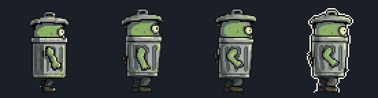

Armored phase: zombie wearing a trash can. Absorbs hits (hurt_armor); `zombie-trashcan-break` knocks the can off, then switch to the trashcan-bare group. No death strips in this phase (die as trashcan-bare).

- group `trashcan` · 10 assets · frame 64x64 · key prefix `zombie-trashcan-` · manifest [enemies/zombies/trashcan/manifest.json](enemies/zombies/trashcan/manifest.json)
- previews: [armored-actions-sheet.png](previews/zombies/trashcan/armored-actions-sheet.png), [special-sheet.png](previews/zombies/trashcan/special-sheet.png), [elemental-hits-sheet.png](previews/zombies/trashcan/elemental-hits-sheet.png)

| Key | Frames | Size | FPS | Playback | Origin | Notes |
|---|---:|---|---:|---|---|---|
| `zombie-trashcan-walk` | 8 | 64x64 | 8 | loop | (0.5, 1.0) |  |
| `zombie-trashcan-run` | 8 | 64x64 | 12 | loop | (0.5, 1.0) |  |
| `zombie-trashcan-attack` | 8 | 64x64 | 10 | loop | (0.5, 1.0) |  |
| `zombie-trashcan-bite` | 8 | 64x64 | 10 | loop | (0.5, 1.0) |  |
| `zombie-trashcan-idle_itch` | 8 | 64x64 | 6 | loop | (0.5, 1.0) |  |
| `zombie-trashcan-hurt_armor` | 6 | 64x64 | 10 | once | (0.5, 1.0) |  |
| `zombie-trashcan-break` | 8 | 64x64 | 10 | once | (0.5, 1.0) |  |
| `zombie-trashcan-hurt_freeze` | 8 | 64x64 | 10 | once | (0.5, 1.0) |  |
| `zombie-trashcan-hurt_burn` | 8 | 64x64 | 10 | loop | (0.5, 1.0) |  |
| `zombie-trashcan-hurt_shock` | 6 | 64x64 | 12 | loop | (0.5, 1.0) |  |

### Trash Can Zombie (bare, after break) (垃圾桶喪屍（破甲後）)

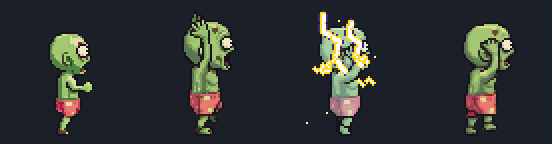

Unarmored phase after `zombie-trashcan-break`: full move set plus a panic run.

- group `trashcan-bare` · 12 assets · frame 64x64 · key prefix `zombie-trashcan-bare-` · manifest [enemies/zombies/trashcan-bare/manifest.json](enemies/zombies/trashcan-bare/manifest.json)
- previews: [bare-actions-sheet.png](previews/zombies/trashcan-bare/bare-actions-sheet.png)

| Key | Frames | Size | FPS | Playback | Origin | Notes |
|---|---:|---|---:|---|---|---|
| `zombie-trashcan-bare-walk` | 8 | 64x64 | 8 | loop | (0.5, 1.0) |  |
| `zombie-trashcan-bare-run` | 8 | 64x64 | 12 | loop | (0.5, 1.0) |  |
| `zombie-trashcan-bare-die1` | 8 | 64x64 | 10 | once | (0.5, 1.0) |  |
| `zombie-trashcan-bare-die2` | 8 | 64x64 | 10 | once | (0.5, 1.0) |  |
| `zombie-trashcan-bare-attack` | 8 | 64x64 | 10 | loop | (0.5, 1.0) |  |
| `zombie-trashcan-bare-bite` | 8 | 64x64 | 10 | loop | (0.5, 1.0) |  |
| `zombie-trashcan-bare-hurt` | 4 | 64x64 | 10 | once | (0.5, 1.0) |  |
| `zombie-trashcan-bare-idle_itch` | 8 | 64x64 | 6 | loop | (0.5, 1.0) |  |
| `zombie-trashcan-bare-hurt_freeze` | 8 | 64x64 | 10 | once | (0.5, 1.0) |  |
| `zombie-trashcan-bare-hurt_burn` | 8 | 64x64 | 10 | loop | (0.5, 1.0) |  |
| `zombie-trashcan-bare-hurt_shock` | 6 | 64x64 | 12 | loop | (0.5, 1.0) |  |
| `zombie-trashcan-bare-panic` | 8 | 64x64 | 10 | loop | (0.5, 1.0) |  |

## Bosses

### The Molten Giant, Balon (熔岩巨魔・巴倫)

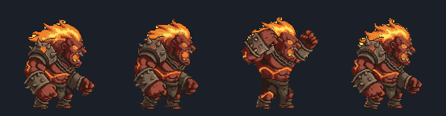

Lava boss (128x128). Skills: lava_slam (fx-slam at impact), volcanic_breath (sustained start/loop/end + fx-breath attached at the mouth), meteor_storm (spawn fx-meteor + fx-meteor-impact during castFrames).

- group `lava-balon` · 15 assets · frame 128x128 · key prefix `zombie-boss-lava-` · manifest [enemies/bosses/lava-balon/manifest.json](enemies/bosses/lava-balon/manifest.json)
- previews: [all-actions-sheet.png](previews/bosses/lava-balon/all-actions-sheet.png), [skills-sheet.png](previews/bosses/lava-balon/skills-sheet.png), [elemental-hits-sheet.png](previews/bosses/lava-balon/elemental-hits-sheet.png), [skill-lava_slam.gif](previews/bosses/lava-balon/skill-lava_slam.gif), [skill-volcanic_breath.gif](previews/bosses/lava-balon/skill-volcanic_breath.gif), [skill-meteor_storm.gif](previews/bosses/lava-balon/skill-meteor_storm.gif)

| Key | Frames | Size | FPS | Playback | Origin | Notes |
|---|---:|---|---:|---|---|---|
| `zombie-boss-lava-spawn` | 12 | 128x128 | 10 | once | (0.5, 1.0) | rises out of a lava pool (frames 0-5), then roars (6-11) |
| `zombie-boss-lava-idle` | 8 | 128x128 | 6 | loop | (0.5, 1.0) |  |
| `zombie-boss-lava-walk` | 8 | 128x128 | 8 | loop | (0.5, 1.0) |  |
| `zombie-boss-lava-run` | 8 | 128x128 | 12 | loop | (0.5, 1.0) |  |
| `zombie-boss-lava-attack` | 8 | 128x128 | 10 | loop | (0.5, 1.0) |  |
| `zombie-boss-lava-hurt` | 6 | 128x128 | 10 | once | (0.5, 1.0) |  |
| `zombie-boss-lava-hurt_freeze` | 8 | 128x128 | 10 | once | (0.5, 1.0) | lava cools to a dark slate crust, ice crystals + ice mound; ends frozen (hold last frame) |
| `zombie-boss-lava-hurt_burn` | 8 | 128x128 | 10 | loop | (0.5, 1.0) | overheat / flare variant: lava cracks blaze white-hot, flame mane flares |
| `zombie-boss-lava-hurt_shock` | 6 | 128x128 | 12 | loop | (0.5, 1.0) |  |
| `zombie-boss-lava-enrage` | 8 | 128x128 | 8 | loop | (0.5, 1.0) |  |
| `zombie-boss-lava-die1` | 12 | 128x128 | 10 | once | (0.5, 1.0) |  |
| `zombie-boss-lava-die2` | 12 | 128x128 | 10 | once | (0.5, 1.0) |  |
| `zombie-boss-lava-lava_slam` | 12 | 128x128 | 10 | once | (0.5, 1.0) | fx: `zombie-boss-lava-fx-slam` · 0-4 wind-up, 5-6 down-swing (smear), 7 impact (start fx-slam), 8-11 recovery |
| `zombie-boss-lava-volcanic_breath` | 12 | 128x128 | 10 | start 0-4 once, loop 5-10, end 11-11 once | (0.5, 1.0) | fx: `zombie-boss-lava-fx-breath` · play startRange once, repeat loopRange while breathing, then endRange; fx-breath is attached from character frame 4 |
| `zombie-boss-lava-meteor_storm` | 12 | 128x128 | 10 | once | (0.5, 1.0) | fx: `zombie-boss-lava-fx-meteor`, `zombie-boss-lava-fx-meteor-impact` |

### The Molten Giant, Balon — skill FX (熔岩巨魔・巴倫 技能特效)

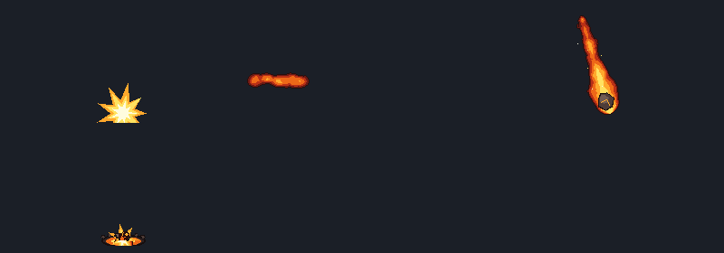

Skill FX strips for The Molten Giant, Balon. Origins and attach offsets are per key (see anchors/timing); offsets are in px relative to the boss origin (bottom-centre), east-facing; mirror x if the boss is flipped.

- group `lava-balon-fx` · 4 assets · frame 64x128, 96x64, 256x96, 256x128 · key prefix `zombie-boss-lava-fx-` · manifest [enemies/bosses/lava-balon/fx/manifest.json](enemies/bosses/lava-balon/fx/manifest.json)
- previews: [fx-slam-sheet.png](previews/bosses/lava-balon-fx/fx-slam-sheet.png), [fx-breath-sheet.png](previews/bosses/lava-balon-fx/fx-breath-sheet.png), [fx-meteor-sheet.png](previews/bosses/lava-balon-fx/fx-meteor-sheet.png), [fx-meteor-impact-sheet.png](previews/bosses/lava-balon-fx/fx-meteor-impact-sheet.png)

| Key | Frames | Size | FPS | Playback | Origin | Notes |
|---|---:|---|---:|---|---|---|
| `zombie-boss-lava-fx-slam` | 12 | 256x128 | 12 | once | (0.5, 1.0) | attach to `zombie-boss-lava-lava_slam` frame 7 offset [44, 0] · ground crack + shockwave expand east, lava geysers erupt from the cracks, rock debris, dust; good moment for screen shake: fx frames 0-3 |
| `zombie-boss-lava-fx-breath` | 14 | 256x96 | 12 | start 0-3 once, loop 4-9, end 10-13 once | (0.0, 0.5) | attach to `zombie-boss-lava-volcanic_breath` frame 4 offset [56, -80] · play 0-3 once, loop 4-9 while the character loops its frames 5-10, then 10-13 once (stream detaches and burns out) |
| `zombie-boss-lava-fx-meteor` | 6 | 64x128 | 12 | loop | (0.59375, 0.8125) | single meteor; the game moves it along travelDirection (down, slightly east) and spawns fx-meteor-impact where the rock meets the ground. spawn many during meteor_storm castFrames |
| `zombie-boss-lava-fx-meteor-impact` | 8 | 96x64 | 12 | once | (0.5, 1.0) |  |

### The Cyber-Steel Behemoth, Balam (鋼鐵巨獸・巴拉姆)

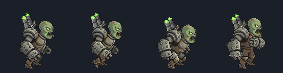

Steel boss (128x128). Skills: ground_smash (fx-smash at impactPoint), bio_acid_spit (sustained loop 7-10 + fx-acid on mouthAnchors, fx-acid-pool on the ground), steel_whirlwind (loop 3-8 with fx-whirlwind front + back layers).

- group `steel-balam` · 15 assets · frame 128x128 · key prefix `zombie-boss-steel-` · manifest [enemies/bosses/steel-balam/manifest.json](enemies/bosses/steel-balam/manifest.json)
- previews: [all-actions-sheet.png](previews/bosses/steel-balam/all-actions-sheet.png), [skills-sheet.png](previews/bosses/steel-balam/skills-sheet.png), [elemental-hits-sheet.png](previews/bosses/steel-balam/elemental-hits-sheet.png), [skill-ground_smash.gif](previews/bosses/steel-balam/skill-ground_smash.gif), [skill-bio_acid_spit.gif](previews/bosses/steel-balam/skill-bio_acid_spit.gif), [skill-steel_whirlwind.gif](previews/bosses/steel-balam/skill-steel_whirlwind.gif)

| Key | Frames | Size | FPS | Playback | Origin | Notes |
|---|---:|---|---:|---|---|---|
| `zombie-boss-steel-spawn` | 12 | 128x128 | 10 | once | (0.5, 1.0) |  |
| `zombie-boss-steel-idle` | 8 | 128x128 | 6 | loop | (0.5, 1.0) |  |
| `zombie-boss-steel-walk` | 8 | 128x128 | 8 | loop | (0.5, 1.0) |  |
| `zombie-boss-steel-run` | 8 | 128x128 | 12 | loop | (0.5, 1.0) |  |
| `zombie-boss-steel-attack` | 8 | 128x128 | 10 | once | (0.5, 1.0) |  |
| `zombie-boss-steel-hurt` | 8 | 128x128 | 12 | once | (0.5, 1.0) |  |
| `zombie-boss-steel-hurt_freeze` | 8 | 128x128 | 10 | once | (0.5, 1.0) |  |
| `zombie-boss-steel-hurt_burn` | 8 | 128x128 | 10 | loop | (0.5, 1.0) |  |
| `zombie-boss-steel-hurt_shock` | 6 | 128x128 | 12 | loop | (0.5, 1.0) |  |
| `zombie-boss-steel-enrage` | 8 | 128x128 | 10 | loop | (0.5, 1.0) | low-HP rage loop |
| `zombie-boss-steel-ground_smash` | 12 | 128x128 | 10 | once | (0.5, 1.0) | fx: `zombie-boss-steel-fx-smash` · impactPoint [49, 0] |
| `zombie-boss-steel-bio_acid_spit` | 12 | 128x128 | 10 | start 0-6 once, loop 7-10, end 11-11 once | (0.5, 1.0) | fx: `zombie-boss-steel-fx-acid`, `zombie-boss-steel-fx-acid-pool` · mouthAnchors per frame |
| `zombie-boss-steel-steel_whirlwind` | 12 | 128x128 | 12 | start 0-2 once, loop 3-8, end 9-11 once | (0.5, 1.0) | fx: `zombie-boss-steel-fx-whirlwind`, `zombie-boss-steel-fx-whirlwind-back` |
| `zombie-boss-steel-die1` | 12 | 128x128 | 10 | once | (0.5, 1.0) |  |
| `zombie-boss-steel-die2` | 12 | 128x128 | 10 | once | (0.5, 1.0) | big defeat, clearly different from die1 (kneel then face-down collapse, plates pop off, toxic smoke) |

### The Cyber-Steel Behemoth, Balam — skill FX (鋼鐵巨獸・巴拉姆 技能特效)

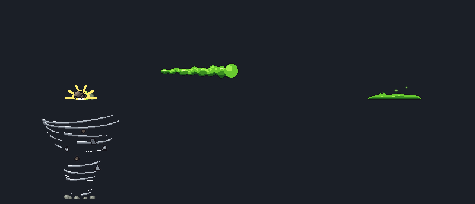

Skill FX strips for The Cyber-Steel Behemoth, Balam. Origins and attach offsets are per key (see anchors/timing); offsets are in px relative to the boss origin (bottom-centre), east-facing; mirror x if the boss is flipped.

- group `steel-balam-fx` · 5 assets · frame 96x32, 160x160, 256x96, 256x128 · key prefix `zombie-boss-steel-fx-` · manifest [enemies/bosses/steel-balam/fx/manifest.json](enemies/bosses/steel-balam/fx/manifest.json)

| Key | Frames | Size | FPS | Playback | Origin | Notes |
|---|---:|---|---:|---|---|---|
| `zombie-boss-steel-fx-smash` | 10 | 256x128 | 12 | once | (0.5, 1.0) | plays from ground_smash character frame 5; origin (bottom-center) goes on the fist impact point = character origin + (49,0) px |
| `zombie-boss-steel-fx-acid` | 10 | 256x96 | 10 | start 0-1 once, loop 2-5, end 6-9 once | (0.0, 0.5) | origin (left-middle) goes on the mouth anchor of the current bio_acid_spit frame (mouthAnchors). Start frames play with character frames 4-5, loop while the character loops 6-9, end frames play after (stream detaches). |
| `zombie-boss-steel-fx-acid-pool` | 8 | 96x32 | 8 | loop | (0.5, 1.0) | lingering damage puddle, origin bottom-center on the ground |
| `zombie-boss-steel-fx-whirlwind` | 8 | 160x160 | 14 | loop | (0.5, 1.0) | front layer: draw OVER the boss; origin bottom-center = boss origin; play while steel_whirlwind loops (frames 2-7) |
| `zombie-boss-steel-fx-whirlwind-back` | 8 | 160x160 | 14 | loop | (0.5, 1.0) | back layer: draw UNDER the boss, same origin/timing as fx-whirlwind |

## Shared FX

### Exploder Toxic Blast (劇毒爆炸)

Standalone 160x160 toxic explosion, origin centre (0.5,0.5). Spawn where zombie-exploder dies / explodes; reusable for any chain-reaction or bomb.

- group `exploder-blast` · 1 assets · frame 160x160 · manifest [fx/manifest.json](fx/manifest.json)
- previews: [blast-sheet.png](previews/fx/exploder-blast/blast-sheet.png)

| Key | Frames | Size | FPS | Playback | Origin | Notes |
|---|---:|---|---:|---|---|---|
| `zombie-exploder-blast` | 10 | 160x160 | 12 | once | (0.5, 0.5) |  |

## Pickups

### Clown Loot Pickups (小丑掉落物)

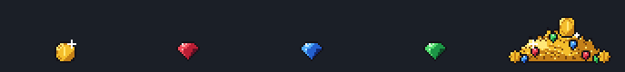

16x16 spinning coin and three gems (origin centre) plus a 64x32 loot pile (origin bottom-centre, = last frame of zombie-clown-loot_explode).

- group `clown-loot` · 5 assets · frame 16x16, 64x32 · key prefix `zombie-clown-` · manifest [pickups/manifest.json](pickups/manifest.json)
- previews: [pickups-sheet.png](previews/pickups/clown-loot/pickups-sheet.png)

| Key | Frames | Size | FPS | Playback | Origin | Notes |
|---|---:|---|---:|---|---|---|
| `zombie-clown-coin` | 8 | 16x16 | 10 | loop | (0.5, 0.5) | 16x16 spinning gold coin pickup, loop. |
| `zombie-clown-gem-red` | 6 | 16x16 | 8 | loop | (0.5, 0.5) | 16x16 sparkling red gem pickup, loop. |
| `zombie-clown-gem-blue` | 6 | 16x16 | 8 | loop | (0.5, 0.5) | 16x16 sparkling blue gem pickup, loop. |
| `zombie-clown-gem-green` | 6 | 16x16 | 8 | loop | (0.5, 0.5) | 16x16 sparkling green gem pickup, loop. |
| `zombie-clown-loot-pile` | 4 | 64x32 | 6 | loop | (0.5, 1.0) | 64x32 coin/gem pile (static = frame 0, or loop the 4-frame sparkle). Same art as the last frame of loot_explode. |

## Backgrounds

### Campus Battle Background (校園戰場背景)

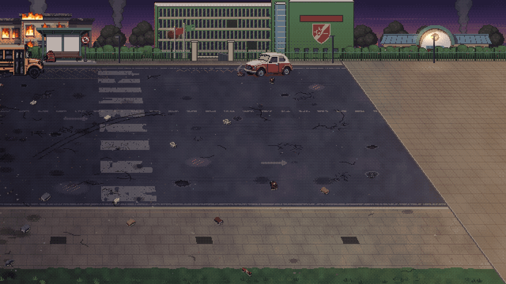

1280x720 campus background (authored 640x360, 2x nearest). Variants A (road, dusk, best), B (yard, dusk), C (night A). Layered far/ground/mid + animated fire and lamp glow. Top-left goes at world (832, 0) = the fixed camera scrollX.

- group `campus` · 15 assets · frame 112x52, 170x126, 1280x720, 1360x768 · key prefix `bg-campus-` · manifest [backgrounds/campus/manifest.json](backgrounds/campus/manifest.json)
- previews: [variants-sheet.png](previews/backgrounds/campus/variants-sheet.png), [mock-A.png](previews/backgrounds/campus/mock-A.png), [mock-B.png](previews/backgrounds/campus/mock-B.png), [mock-C.png](previews/backgrounds/campus/mock-C.png), [preview-B.gif](previews/backgrounds/campus/preview-B.gif), [preview-C.gif](previews/backgrounds/campus/preview-C.gif)

| Key | File | Size | Type | Notes |
|---|---|---|---|---|
| `bg-campus-a` | [variant-A.png](backgrounds/campus/variant-A.png) | 1280x720 | background | Variant A (best): road in front of the school gate at dusk, flattened 1280x720 (fire frame 0 baked in). |
| `bg-campus-b` | [variant-B.png](backgrounds/campus/variant-B.png) | 1280x720 | background | Variant B: school yard at dusk (pitch, statue, hoop, pond), flattened 1280x720. |
| `bg-campus-c` | [variant-C.png](backgrounds/campus/variant-C.png) | 1280x720 | background | Variant C: night version of A, relit, flattened 1280x720. |
| `bg-campus-far` | [bg-far.png](backgrounds/campus/layers/bg-far.png) | 1280x720 | background | Layer: opaque sky, skyline, buildings, trees, smoke — variant A (dusk). Depth 3. |
| `bg-campus-ground` | [bg-ground.png](backgrounds/campus/layers/bg-ground.png) | 1280x720 | background | Layer: perspective ground, transparent above y=148 — variant A (dusk). Depth 4. |
| `bg-campus-mid` | [bg-mid.png](backgrounds/campus/layers/bg-mid.png) | 1280x720 | background | Layer: transparent fence, gate, hedges, flags, lamps, bus stop, car, bus — variant A (dusk). Depth 5. |
| `bg-campus-full` | [bg-full.png](backgrounds/campus/layers/bg-full.png) | 1280x720 | background | Layer stack flattened (identical to variant-A.png) — variant A (dusk). |
| `bg-campus-full-bleed` | [bg-full-bleed.png](backgrounds/campus/layers/bg-full-bleed.png) | 1360x768 | background | 1360x768 flattened with mirrored 40/24px margins for camera shake — variant A (dusk). Place at (832-40, -24). |
| `bg-campus-night-far` | [bg-far.png](backgrounds/campus/layers-night/bg-far.png) | 1280x720 | background | Layer: opaque sky, skyline, buildings, trees, smoke — variant C (night). Depth 3. |
| `bg-campus-night-ground` | [bg-ground.png](backgrounds/campus/layers-night/bg-ground.png) | 1280x720 | background | Layer: perspective ground, transparent above y=148 — variant C (night). Depth 4. |
| `bg-campus-night-mid` | [bg-mid.png](backgrounds/campus/layers-night/bg-mid.png) | 1280x720 | background | Layer: transparent fence, gate, hedges, flags, lamps, bus stop, car, bus — variant C (night). Depth 5. |
| `bg-campus-night-full` | [bg-full.png](backgrounds/campus/layers-night/bg-full.png) | 1280x720 | background | Layer stack flattened (identical to variant-C.png) — variant C (night). |
| `bg-campus-night-full-bleed` | [bg-full-bleed.png](backgrounds/campus/layers-night/bg-full-bleed.png) | 1360x768 | background | 1360x768 flattened with mirrored 40/24px margins for camera shake — variant C (night). Place at (832-40, -24). |
| `bg-campus-fire` | [fire-burning-block.png](backgrounds/campus/anim/fire-burning-block.png) | 170x126 | spritesheet | 8f @ 10fps loop. Seamless 8-frame fire loop for the burning block (9 windows + roof). Layers contain no baked flames; flattened variants have frame 0 baked in. |
| `bg-campus-lamp` | [lamp-glow.png](backgrounds/campus/anim/lamp-glow.png) | 112x52 | spritesheet | 6f @ 6fps loop. Lamp flicker glow, 6 frames, additive blend (ADD). |

## Concepts

### Chibi Zombie Concept Drafts (Q版喪屍概念草圖)

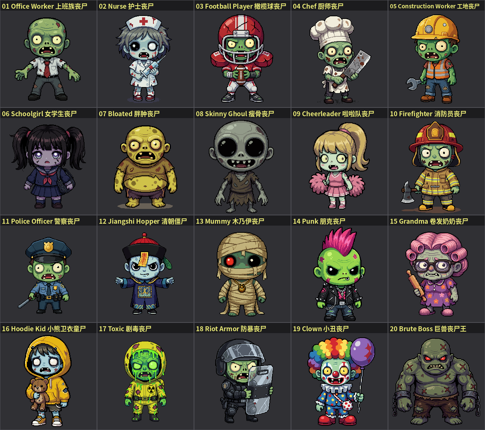

20 front-view 256x256 concept images (PixelLab create_image_pixen). Concept art only — NOT game-ready sprites (no animation, wrong facing). Use as design reference.

- group `zombie-chibi-drafts` · 21 assets · frame 256x256, 1280x1136 · key prefix `concept-chibi-` · manifest [concepts/zombie-chibi-drafts/manifest.json](concepts/zombie-chibi-drafts/manifest.json)
- previews: [contact-sheet.png](previews/concepts/zombie-chibi-drafts/contact-sheet.png)

| Key | File | Size | Type | Notes |
|---|---|---|---|---|
| `concept-chibi-01-office-worker` | [01_office-worker.png](concepts/zombie-chibi-drafts/01_office-worker.png) | 256x256 | concept | Office Worker Zombie / 上班族丧尸 |
| `concept-chibi-02-nurse` | [02_nurse.png](concepts/zombie-chibi-drafts/02_nurse.png) | 256x256 | concept | Nurse Zombie / 护士丧尸 |
| `concept-chibi-03-football-player` | [03_football-player.png](concepts/zombie-chibi-drafts/03_football-player.png) | 256x256 | concept | Football Player Zombie / 橄榄球丧尸 |
| `concept-chibi-04-chef` | [04_chef.png](concepts/zombie-chibi-drafts/04_chef.png) | 256x256 | concept | Chef Zombie / 厨师丧尸 |
| `concept-chibi-05-construction-worker` | [05_construction-worker.png](concepts/zombie-chibi-drafts/05_construction-worker.png) | 256x256 | concept | Construction Worker Zombie / 工地丧尸 |
| `concept-chibi-06-schoolgirl` | [06_schoolgirl.png](concepts/zombie-chibi-drafts/06_schoolgirl.png) | 256x256 | concept | Schoolgirl Zombie / 女学生丧尸 |
| `concept-chibi-07-bloated` | [07_bloated.png](concepts/zombie-chibi-drafts/07_bloated.png) | 256x256 | concept | Bloated Zombie / 胖肿丧尸 |
| `concept-chibi-08-skinny-ghoul` | [08_skinny-ghoul.png](concepts/zombie-chibi-drafts/08_skinny-ghoul.png) | 256x256 | concept | Skinny Ghoul / 瘦骨丧尸 |
| `concept-chibi-09-cheerleader` | [09_cheerleader.png](concepts/zombie-chibi-drafts/09_cheerleader.png) | 256x256 | concept | Cheerleader Zombie / 啦啦队丧尸 |
| `concept-chibi-10-firefighter` | [10_firefighter.png](concepts/zombie-chibi-drafts/10_firefighter.png) | 256x256 | concept | Firefighter Zombie / 消防员丧尸 |
| `concept-chibi-11-police-officer` | [11_police-officer.png](concepts/zombie-chibi-drafts/11_police-officer.png) | 256x256 | concept | Police Officer Zombie / 警察丧尸 |
| `concept-chibi-12-jiangshi` | [12_jiangshi.png](concepts/zombie-chibi-drafts/12_jiangshi.png) | 256x256 | concept | Jiangshi Hopper / 清朝僵尸 |
| `concept-chibi-13-mummy` | [13_mummy.png](concepts/zombie-chibi-drafts/13_mummy.png) | 256x256 | concept | Mummy Zombie / 木乃伊丧尸 |
| `concept-chibi-14-punk` | [14_punk.png](concepts/zombie-chibi-drafts/14_punk.png) | 256x256 | concept | Punk Zombie / 朋克丧尸 |
| `concept-chibi-15-grandma` | [15_grandma.png](concepts/zombie-chibi-drafts/15_grandma.png) | 256x256 | concept | Grandma Zombie / 卷发奶奶丧尸 |
| `concept-chibi-16-kid-teddy` | [16_kid-teddy.png](concepts/zombie-chibi-drafts/16_kid-teddy.png) | 256x256 | concept | Hoodie Kid Zombie / 小熊卫衣童尸 |
| `concept-chibi-17-toxic` | [17_toxic.png](concepts/zombie-chibi-drafts/17_toxic.png) | 256x256 | concept | Toxic Zombie / 剧毒丧尸 |
| `concept-chibi-18-riot-armor` | [18_riot-armor.png](concepts/zombie-chibi-drafts/18_riot-armor.png) | 256x256 | concept | Riot Armor Zombie / 防暴丧尸 |
| `concept-chibi-19-clown` | [19_clown.png](concepts/zombie-chibi-drafts/19_clown.png) | 256x256 | concept | Clown Zombie / 小丑丧尸 |
| `concept-chibi-20-brute-boss` | [20_brute-boss.png](concepts/zombie-chibi-drafts/20_brute-boss.png) | 256x256 | concept | Brute Boss Zombie / 巨兽丧尸王 |
| `concept-chibi-contact-sheet` | [contact-sheet.png](concepts/zombie-chibi-drafts/contact-sheet.png) | 1280x1136 | concept | Contact sheet of all 20 chibi zombie concepts (5x4). |
